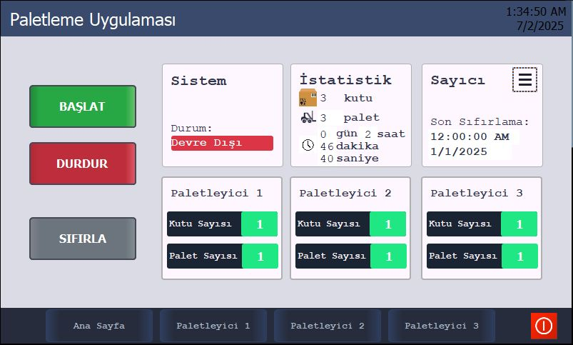
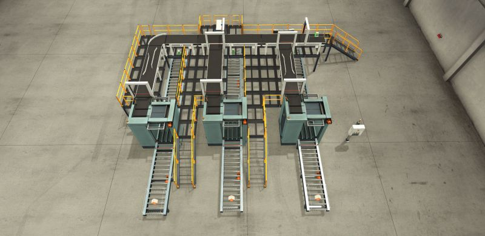
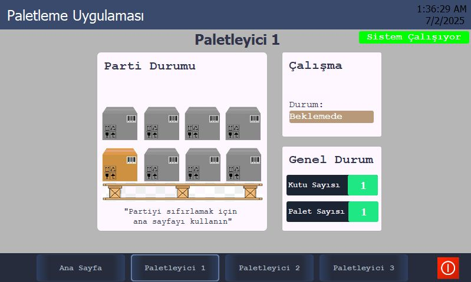

<table align="center" border="0" cellspacing="0" cellpadding="0" style="border:none;">
  <tr style="border:none;">
    <td width="33%" style="border:none; padding:0;">
      
    </td>
    <td width="33%" style="border:none; padding:0;">
      
    </td>
    <td width="33%" style="border:none; padding:0;">
      
    </td>
  </tr>
</table>

<h1 align="center">PLC Palletizing System</h1>

PLC-based sorting & palletizing with HMI integration

## 📌 Project Overview
This project is a **PLC-based palletizing system** developed as a university course project. The system sorts boxes according to their **sizes** and then palletizes them based on predefined logic. The project was later enhanced by adding an **HMI (Human-Machine Interface)** for better monitoring and control.

This project demonstrates:
- Box sorting based on size
- Size-dependent palletizing logic
- Industrial automation principles
- PLC program structure
- HMI integration

---

## 🏭 System Description
The palletizing system is designed to perform the following tasks:
- Detect and classify boxes according to their dimensions
- Route boxes based on size categories
- Execute palletizing operations according to the assigned box type
- Provide a safe and structured palletizing process

The system was initially developed **without an HMI** and later upgraded with **HMI screens** to improve operator interaction and system monitoring.

---

## 🧩 Project Versions

### 🔹 v1 – Initial Version (March 2025)
- PLC logic only
- No HMI screens
- Core sorting and palletizing functionality implemented

📁 File:
- `plc-palletizing-system.rar`

---

### 🔹 v2 – HMI Integrated Version (Latest)
- HMI screens added
- Improved control and monitoring
- Operator-friendly interface

📁 File:
- `plc-palletizing-system-hmi.rar`

---

## 🛠️ Technologies Used
- PLC Programming (Siemens S7-1500)
- Factory I/O (Simulation Environment)
- HMI Design

---

## 🎓 Notes
- This project was developed for **educational purposes**.
- It is **not affiliated with any company**.
- All files are shared for learning and demonstration purposes only.

---

## 👤 Author
**Arda Bektaş**  
Industrial Automation Enthusiast

---

## ⭐ Repository Usage
Feel free to explore the project files. If you find this project useful, consider giving it a ⭐ on GitHub.
